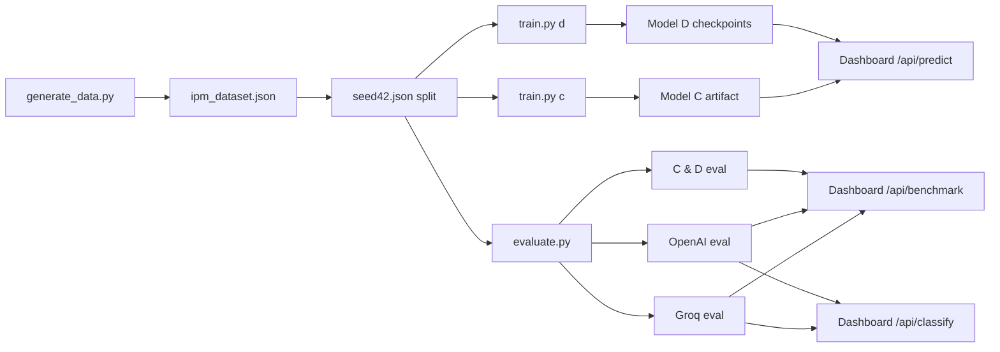

# IPM Flow — NLP Tagging Benchmark

Comparative evaluation of **four models** that classify business-need pitches against the IPM Flow taxonomy. The project covers the full lifecycle: synthetic dataset generation, supervised training, zero-shot LLM inference, unified benchmarking, and an interactive dashboard.

| ID | Name | Type | Technology |
|---|---|---|---|
| **A** | Groq LLM | Zero-shot | `llama-3.3-70b-versatile` |
| **B** | OpenAI LLM | Zero-shot | `gpt-4.1` |
| **C** | TF-IDF + LR | Supervised | scikit-learn TF-IDF + Logistic Regression |
| **D** | DistilBERT | Supervised | Fine-tuned encoder (early stopping, class weights, tuned thresholds) |

---

## How it works (end to end)



1. **Generate** — Build a labeled dataset of ~500 enterprise pitches (`scripts/generate_data.py`).
2. **Split** — Create a stratified 80/20 train/test split shared by all models (`data/splits/seed42.json`).
3. **Train** — Fit Models C and D on the training set (`scripts/train.py c|d`).
4. **Evaluate** — Score all four models on the same held-out test set (`scripts/evaluate.py`).
5. **Serve** — Launch the dashboard to compare scores and try live classification (`scripts/serve.py`).

---

## The four dimensions

Every pitch is tagged along four IPM Flow dimensions. Definitions live in `src/ipmflow/taxonomy.py`.

### `objective` — single label

The primary business goal of the pitch.

| Value | Meaning |
|---|---|
| `cost_reduction` | Cut costs, automate manual work, optimize resources |
| `cx_improvement` | Improve customer or employee experience, service quality |
| `risk_mitigation` | Reduce risk, security, compliance, fraud |
| `market_opportunity` | Capture new markets, revenue streams, competitive advantage |

### `domain` — multi-label

One or more technology or business domains involved.

`AI` · `Cloud` · `Cybersecurity` · `Data` · `HR` · `Finance` · `Operations` · `Other`

### `impact` — multi-label

Expected business impact areas.

`Revenue` · `Cost` · `Risk` · `CustomerExperience`

### `origin` — single label

What triggered the need.

| Value | Meaning |
|---|---|
| `market_driver` | Market trends, competition, regulation, emerging tech |
| `operational_problem` | Internal pain point, inefficiency, technical debt |
| `client_request` | Explicit client request, contract requirement, complaint |

**Classification types**

- **Single-label** (`objective`, `origin`): exactly one class is chosen (argmax probability or LLM pick).
- **Multi-label** (`domain`, `impact`): zero or more classes can apply; a label is kept when its probability exceeds a threshold (minimum one label is always returned).

---

## Dataset generation

```bash
python scripts/generate_data.py
```

This writes `data/processed/ipm_dataset.json` and creates the train/test split.

**Sources** (defined in `src/ipmflow/data/generate.py`):

| Source | Role |
|---|---|
| `real` | ~43 realistic enterprise pitches |
| `edge` | ~22 ambiguous pitches with mixed signals |
| `synthetic` | ~312 template pitches covering the taxonomy |
| `paraphrase` | Augmented variants until the target size (~500) is reached (~123) |

Paraphrase sampling **boosts under-represented classes** (`Cybersecurity`, `HR`, `Finance`, `client_request`) so evaluation is not skewed toward dominant categories.

Each record:

```json
{
  "id": 0,
  "text": "Automate monthly account reconciliation with an RPA tool…",
  "labels": {
    "objective": "cost_reduction",
    "domain": ["Operations", "Finance"],
    "impact": ["Cost", "Risk"],
    "origin": "operational_problem"
  },
  "source": "synthetic"
}
```

**Split** — 80% train / 20% test, stratified on `objective`, seed 42 (`configs/default.yaml`). All models use the same indices in `data/splits/seed42.json`.

---

## Model training (C & D)

Models A and B are zero-shot LLMs — no training step. Models C and D learn from the training split.

```bash
python scripts/train.py c    # TF-IDF + Logistic Regression
python scripts/train.py d    # DistilBERT (4 separate heads)
```

### Model C — TF-IDF + Logistic Regression

One shared TF-IDF vectorizer feeds four classifiers:

| Dimension | Classifier |
|---|---|
| `objective` | Logistic Regression (multiclass) |
| `domain` | One-vs-Rest Logistic Regression |
| `impact` | One-vs-Rest Logistic Regression |
| `origin` | Logistic Regression (multiclass) |

All use `class_weight="balanced"`. Default vectorizer settings (`configs/default.yaml`):

- Unigrams (`ngram_range: [1, 1]`), 5 000 features
- English stop words, sublinear TF scaling
- `C = 5.0`, `max_iter = 1000`

Artifact: `artifacts/ipm_model_c.pkl`.

### Model D — DistilBERT

Four independent DistilBERT heads — one per dimension — each with its own checkpoint:

| Dimension | Loss | Special handling |
|---|---|---|
| `objective` | Cross-entropy | Class weights |
| `domain` | BCE (multi-label) | Per-label threshold tuning on validation |
| `impact` | BCE (multi-label) | Per-label threshold tuning on validation |
| `origin` | Cross-entropy | Class weights |

Training uses early stopping (patience 4), lr = 2e-5, warmup ratio 0.1, dropout 0.2, weight decay 0.01, up to 20 epochs. Embeddings and the first two transformer layers are frozen. A 15% validation holdout from the training split drives early stopping and threshold tuning. Checkpoints: `artifacts/ipm_model_d_{dimension}.pt`.

Device selection (`src/ipmflow/device.py`): NVIDIA CUDA → Intel XPU → CPU.

Settings in `configs/default.yaml` (loaded by `src/ipmflow/config.py`).

---

## Hyperparameter tuning (optional)

```bash
python scripts/tune_hyperparameters.py c          # GridSearchCV on objective (TF-IDF + LR)
python scripts/tune_hyperparameters.py d          # Grid search on one head (default: objective)
python scripts/tune_hyperparameters.py d --head domain
python scripts/tune_hyperparameters.py d --single # One reproducible run with current config
```

**Model C** searches `max_features`, `ngram_range`, `C`, and `l1_ratio` via 3-fold cross-validation on the `objective` head, then prints a suggested `configs/default.yaml` snippet.

**Model D** exhaustively searches lr, dropout, and weight_decay per head (default grid: lr ∈ {5e-6, 1e-5, 2e-5}, dropout ∈ {0.2, 0.3, 0.4}, weight_decay ∈ {0, 0.01}), selecting by validation F1.

---

## How each model classifies

### Models A & B (LLMs)

Both providers receive the same system and user prompts (`src/ipmflow/llm/prompts.py`) with full taxonomy definitions. The user prompt wraps the pitch in triple quotes and accepts optional `rules_context` and `horizon_context` (via `/api/classify` or provider kwargs). They return structured JSON:

```json
{
  "tags": {
    "objective": { "value": "cost_reduction", "confidence": "high" },
    "domain":  [{ "value": "Operations", "confidence": "medium" }],
    "impact":   [{ "value": "Cost", "confidence": "high" }],
    "origin":  { "value": "operational_problem", "confidence": "high" }
  }
}
```

Classification is entirely prompt-driven — the model reads the pitch and picks labels from the taxonomy. No probability scores are produced.

### Model C (TF-IDF + LR)

For each dimension the classifiers output **probabilities**:

- **Single-label** (`objective`, `origin`): pick the class with highest `predict_proba`.
- **Multi-label** (`domain`, `impact`): keep every class whose probability ≥ **0.35** (`MULTILABEL_THRESHOLD`). If none pass, keep the top class.

### Model D (DistilBERT)

Same structure as Model C, but uses neural softmax/sigmoid outputs:

- **Single-label**: softmax → argmax.
- **Multi-label**: sigmoid → per-class threshold. Default 0.35, but **tuned per label** on the validation set for `domain` and `impact` (grid search 0.15–0.75).

---

## AI confidence

Confidence is returned as a **band** — `low`, `medium`, or `high` — not a raw percentage.

### Models C & D — probability-based

Defined in `src/ipmflow/taxonomy.py`:

| Band | Condition |
|---|---|
| **high** | probability > 0.72 |
| **medium** | probability > 0.45 |
| **low** | probability ≤ 0.45 |

- **Single-label** dimensions: band is computed from the winning class probability.
- **Multi-label** dimensions: each retained label gets its **own** band from that label's probability.

This gives a calibrated, comparable signal across the two supervised models without exposing raw floats in the UI.

### Models A & B — self-assessed

The LLM assigns confidence from semantic clarity, following prompt rules:

- **high** — unambiguous wording, clear taxonomy match
- **medium** — implied but not explicit
- **low** — inferred from vague or conflicting signals

These bands are **subjective** (the model's own judgment) and are not calibrated against the training data. They are useful for flagging pitches that need human review, but should not be compared numerically to Models C & D.

---

## Benchmark & comparison

```bash
python scripts/evaluate.py                        # default: llm + trained (A, B, C, D)
python scripts/evaluate.py --models all           # all four models → artifacts/ipm_all_eval.json
python scripts/evaluate.py --models llm           # A + B only
python scripts/evaluate.py --models c,d         # C + D only
python scripts/evaluate.py --models groq --limit 10   # quick smoke test
```

All models are scored on the **same test set** (100 pitches with the default split). Metrics per dimension:

- **Single-label** (`objective`, `origin`): weighted F1
- **Multi-label** (`domain`, `impact`): weighted F1 (binary matrix per label set)

The **average F1** is the unweighted mean across all four dimensions. Results are saved to:

| Model | File |
|---|---|
| A (Groq) | `artifacts/ipm_groq_eval.json` |
| B (OpenAI) | `artifacts/ipm_openai_eval.json` |
| C (TF-IDF) | `artifacts/ipm_model_c_eval.json` |
| D (DistilBERT) | `artifacts/ipm_model_d_eval.json` |
| All combined | `artifacts/ipm_all_eval.json` |

LLM evaluation requires API keys; trained models run locally.

### Latest results (100-pitch held-out test set)

Evaluated with the updated English taxonomy and expanded LLM prompt (`src/ipmflow/llm/prompts.py`).

| Dimension | A — Groq | B — OpenAI | C — TF-IDF | D — DistilBERT | Best |
|---|---|---|---|---|---|
| **objective** | **0.82** | **0.82** | 0.78 | 0.80 | A / B |
| **domain** | 0.70 | 0.71 | **0.80** | 0.77 | C |
| **impact** | 0.79 | 0.80 | **0.81** | 0.80 | C |
| **origin** | 0.63 | 0.54 | **0.83** | 0.80 | C |
| **Avg F1** | 0.74 | 0.72 | **0.80** | 0.79 | **C** |
| **Latency** | ~4.6 s | ~2.7 s | **~0.01 ms** | ~tens ms | C |
| **API errors** | 12/100 | 0/100 | 0 | 0 | B / C / D |

**Takeaways**

- **Model C** still leads on average F1 (0.80) and wins **domain**, **impact**, and **origin**; inference remains effectively instantaneous.
- **Model D** is close behind (0.79) and stays competitive across all dimensions without API dependency.
- **LLMs improved on objective** with the richer prompt (~0.82 vs ~0.77 previously) but remain weak on **origin** (especially OpenAI at 0.54).
- **Groq** hit rate limits and connection errors on 12/100 pitches; scores are computed on 88 successful responses only.
- For production triage, prefer **C** or **D**; use **A/B** in the dashboard playground when you need zero-shot classification without retraining.

---

## Dashboard

```bash
python scripts/serve.py
# → http://localhost:8765/dashboard/index.html
```

| Endpoint | Purpose |
|---|---|
| `GET /api/benchmark` | Load all eval JSON files for the comparison charts |
| `POST /api/predict` | Classify with Model C or D (`{"text": "…", "model": "c"}`) |
| `POST /api/classify` | Classify with Model A or B (`{"text": "…", "provider": "groq", "rules_context": "…", "horizon_context": "…"}`) |
| `GET /api/providers` | Check whether API keys are configured |

Set environment variables for the LLM playground:

```bash
export GROQ_API_KEY="gsk_…"
export OPENAI_API_KEY="sk-…"
```

Optional overrides: `GROQ_MODEL`, `OPENAI_MODEL`, `PORT` (default `8765`; avoid `8080` if Cursor is running).

---

## Project structure

```
.
├── configs/default.yaml          # Split, Model C & D hyperparameters
├── data/
│   ├── processed/ipm_dataset.json
│   └── splits/seed42.json
├── artifacts/                    # Trained weights + eval results
├── dashboard/index.html          # Benchmark UI
├── scripts/
│   ├── generate_data.py
│   ├── train.py
│   ├── evaluate.py
│   ├── predict.py
│   ├── tune_hyperparameters.py
│   └── serve.py
└── src/ipmflow/
    ├── config.py                 # YAML config loader
    ├── paths.py                  # Data, artifact, and config paths
    ├── device.py                 # CUDA / Intel XPU / CPU selection
    ├── cli.py                    # Pip console entry points
    ├── taxonomy.py               # Label definitions + confidence bands
    ├── data/                     # Generation, loading, splits
    ├── models/                   # Model C (sklearn) & D (DistilBERT)
    ├── llm/                      # Model A & B prompts + providers
    ├── eval/                     # Benchmark runner + F1 metrics
    ├── inference/                # Unified predict entry point
    └── serve/                    # HTTP server + benchmark API
```

---

## Quick start

```bash
pip install -e .

python scripts/generate_data.py
python scripts/train.py c
python scripts/train.py d
python scripts/evaluate.py --models all
python scripts/serve.py
```

**CLI inference** (Models C & D only):

```bash
python scripts/predict.py "Automate invoice processing to cut manual handling by 70%." --model d
```

**Pip entry points** (same commands):

```bash
ipmflow-generate
ipmflow-train c
ipmflow-evaluate --models all
ipmflow-predict "…" --model d
ipmflow-serve
```

---

## Requirements

- Python ≥ 3.10
- PyTorch + transformers (Model D)
- scikit-learn (Model C)
- groq + openai SDKs (Models A & B evaluation and dashboard playground)

See `requirements.txt`. For GPU acceleration, install the PyTorch build matching your hardware (CUDA, Intel XPU, or CPU). Model D auto-selects the best available device via `src/ipmflow/device.py`.
